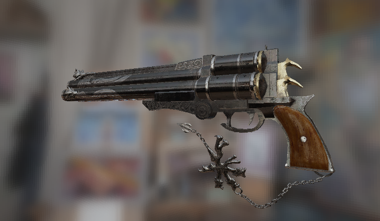
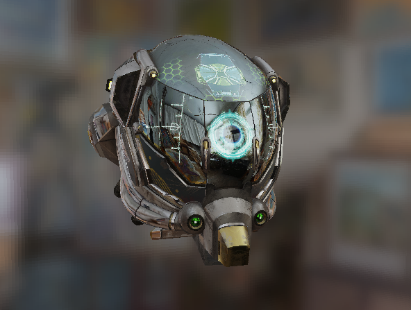

#  Soft_Render

采用C++实现的软光栅渲染器，该渲染器具备渲染管线主要功能，包括顶点处理、三角形绘制、光照 

计算、透视插值、纹理映射、深度测试等，并使用多线程进行绘制的加速处理 

### Image-based lighting

## Main Features

- 使用重心坐标法绘制三角形，采用**多线程**处理

- 实现基于Cook-Torrance BRDF模型的PBR材质，采用**IBL**技术进行光照处理 

- 采用shadowmapping生成阴影，并使用**PCF**进行优化 

- 添加**MSAA**抗锯齿处理

- **SSAO**(环境光遮蔽)
- **天空盒**

- 透视插值矫正、背面剔除等

